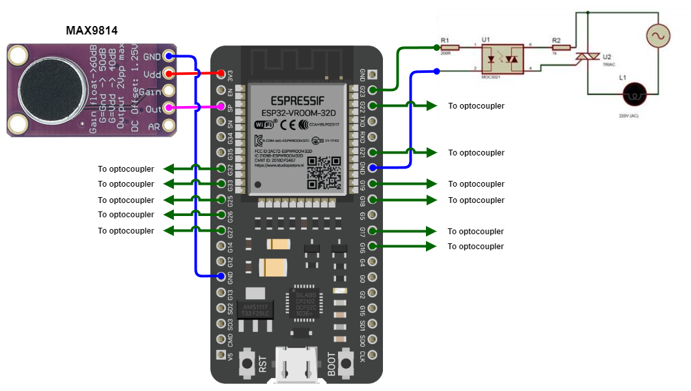
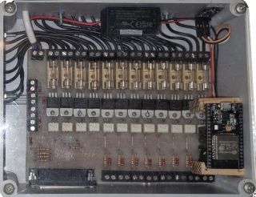
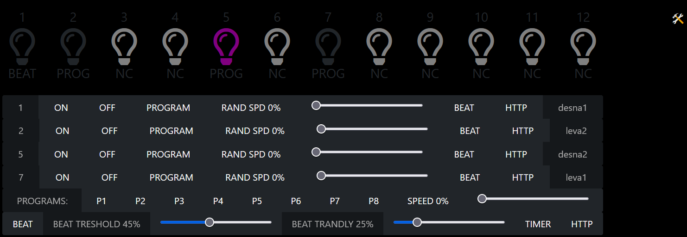
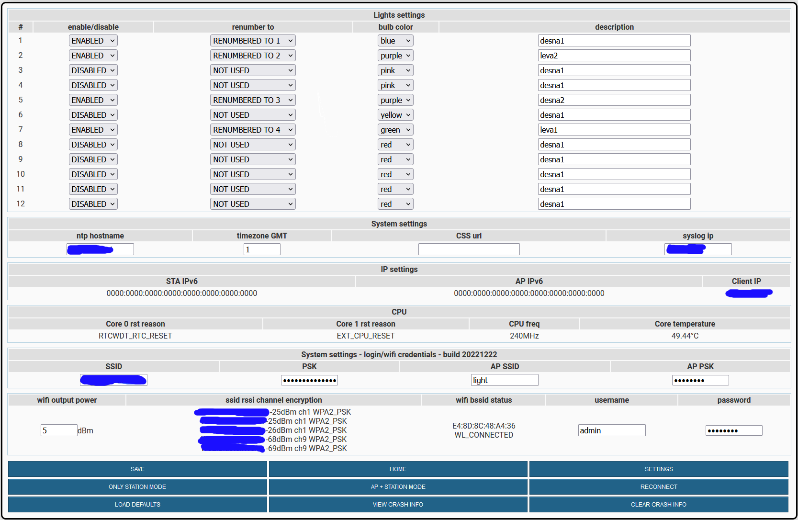

# esp32 light controller

An open source arduino based firmware for esp32. Compiled with arduino ide with esp32 core 2.0.5.

Beat detection is made by using code from Damian Peckett https://create.arduino.cc/projecthub/mamifero/arduino-beat-detector-d0a21f

Light controller is using 12 gpio outputs or 1-12 lights can be connected to it. Number of outputs can be easily extended just add gpio pins to the array `pin_num[]`, `pin_name[]` & `pin_func[]` in light.ino.
The outputs or lights can flash to the beat of the music or they can be programmed into one of the 8 flashing programs. The flashing program can be triggered by a beat of music, a time interval or an http call. The state of each output can be set as: ON, OFF, PROGRAM, RAND SPD, BEAT or HTTP (see screenshots below).

- ON output stays in HIGH state
- OFF output stays in LOW state
- RAND SPD output is randomly flashing according to the selected rate of slider setting
- PROGRAM output is flashing according to the selected program P1 to P8
- BEAT output is flashing to the beat of the music
- HTTP output is flashing on http call (http://ip_address/trigger)

- BEAT programs are triggered by beat of music
- TIMER programs are triggered by time interval, speed is setted with this slider 
- HTTP programs are triggered on http call (http://ip_address/trigger)
- Slider RAND SPD speed of random blinking for individual output
- Slider BEAT TRESHOLD setting for level of music beat detection
- Slider BEAT TRANDLY pulse length adjustment for the program when beat of music is detected 

## Schematics

## Working example (video)

https://user-images.githubusercontent.com/23559198/209428833-85beb53c-6d40-4eb7-9e6a-54f33a109d4d.mp4

Music from Paul Kalkbrenner - Live at Tomorrowland 2022 (https://www.youtube.com/watch?v=fa2N9OBK8v4)

## Flashing the firmware <a href="https://github.com/hanhdt/esp32-flash-tool">ESP32 Flash Tool</a>

Download <a href="https://github.com/ciberp/esp32-light-controller/raw/master/light_v1_esp32.bin">light_v1_esp32.bin</a> and flash :)

After flashing esp will turn on soft AP with ssid *light* and psk *password*. Default creds for settings are user *admin* and pass *password*.

## Screenshots

(http://IP_address/)

settings (http://IP_address/settings)

## TODO

Use websockets with async http server and polish web gui. Remove timezone, CSS and syslog from settings, not needed...
